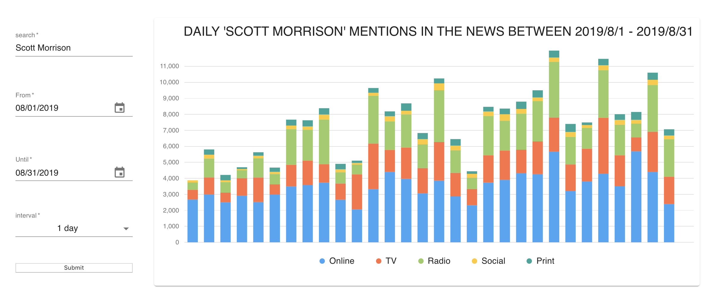

# Charting Application For News Stored In An Elasticsearch Index

### Description
An application that takes data from an Elasticsearch index and charts it on a histogram. There is a form to edit queries.

### How to run the app on your mac

- Download npm package manager
- clone the code from this repository
- type "npm install" to update the package manager
- go to my news-client repository https://github.com/Herdmangct/news-api
- clone the code in the news-client repository
- run bundle to install all the ruby on rails gems 
- run 'rails s' and make sure the server is running on localhost:3000
- navigate back tot the news-client cloned repo and type "npm start" to start the project on your local machine

### App Features

- Form to edit queries to the server
- Histogram of the data from the server

### Technologies Used

- React 
- Semantic UI
- axios

### Author

Graham Herdman
